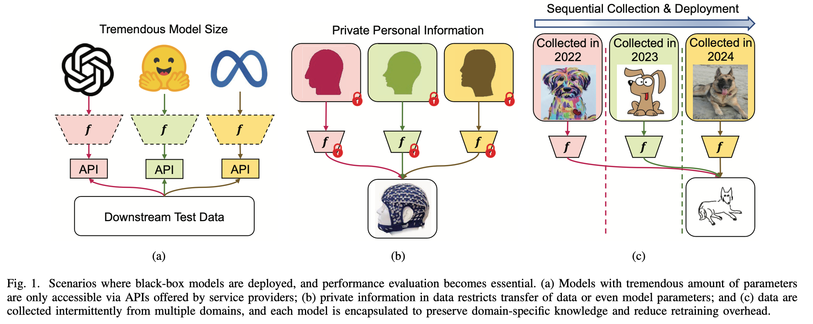

# TestEnsemble: To combine multiple models' predictions
 
<p align="center">
  
</p>

## Implementation of SML-OVR, proposed in our paper "Black-Box Test-Time Ensemble" [IEEE CIM](https://ieeexplore.ieee.org/document/11353100/).

SML-OVR utilizes only the base classifiers’ predictions on unlabeled test data, estimating the reliability of individual base classifiers and constructing a weighted ensemble that favors more accurate ones.

The core advantages of SML-OVR:
1. hyperparameter-free (zero hyperparameters to tune)
2. computationally efficient (only requires milliseconds to compute)
3. online adaptation (can be deployed for real-time online applications)
4. privacy preservation (does not need any knowledge on base classifiers, except conditional independence)

Currently, the implementation for text classification with large language models (LLMs) are provided. We provided the already generated results from the LLMs.

Run the following line to verify results on over 10 combination methods:

```sh 
python ensemble.py
```  

The classification results could also be generated from the LLMs on your own, using HuggingFace's transformers library. 

```sh 
python generate_classification.py
```  

## Implementation of StackingNet, proposed in our paper "StackingNet: collective inference across independent AI foundation models".

The core advantages of StackingNet:
1. computationally efficient (only requires minimum computation to train)
2. privacy preservation (does not need any knowledge on base classifiers, except conditional independence)
3. applicable to both regression and classification
4. supports meta-combination, bias reduction, reliability ranking, and adversary pruning

```sh 
python regression_stackingnet_xxx.py
```  

```sh 
python classification_stackingnet.py
```  

### Update for StackingNet: Oct.9 code upload. Oct. 20 data upload.

## Contact

Please contact me at syoungli@hust.edu.cn or lsyyoungll@gmail.com for questions regarding the paper/research, and use Issues tab for questions regarding the code.

## Citation

If you find this repo helpful, please cite our work:
```
@Article{Li2026SMLOVR,
  author={Li, Siyang and Wang, Ziwei and Liu, Chenhao and Wu, Dongrui},
  journal={IEEE Computational Intelligence Magazine}, 
  title={Black-Box Test-Time Ensemble}, 
  year={2026},
  volume={21},
  number={1},
  pages={57-68}
}

@Article{Li2026StackingNet,
  author={Li, Siyang and Liu, Chenhao and Wu, Dongrui and Zeng, Zhigang and Ding, Lieyun},
  title={StackingNet: Collective Inference across Independent AI Foundation Models}, 
  year={2026},
}
```
