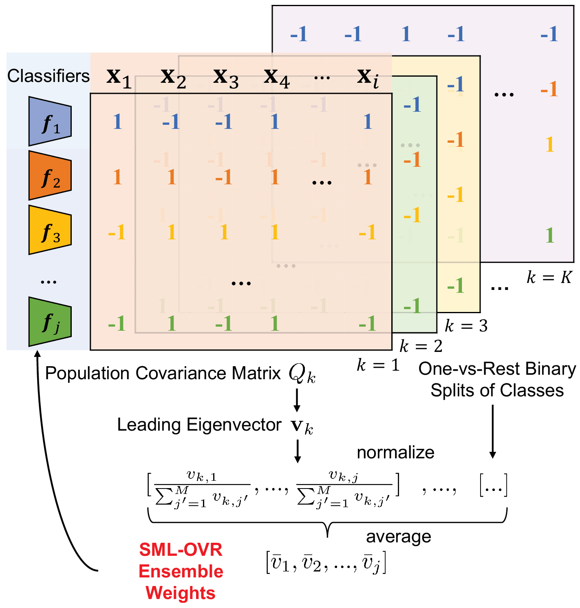
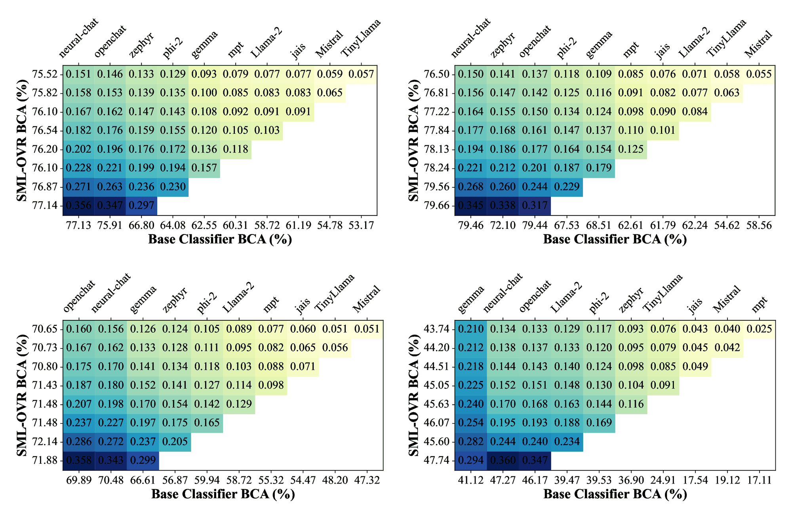
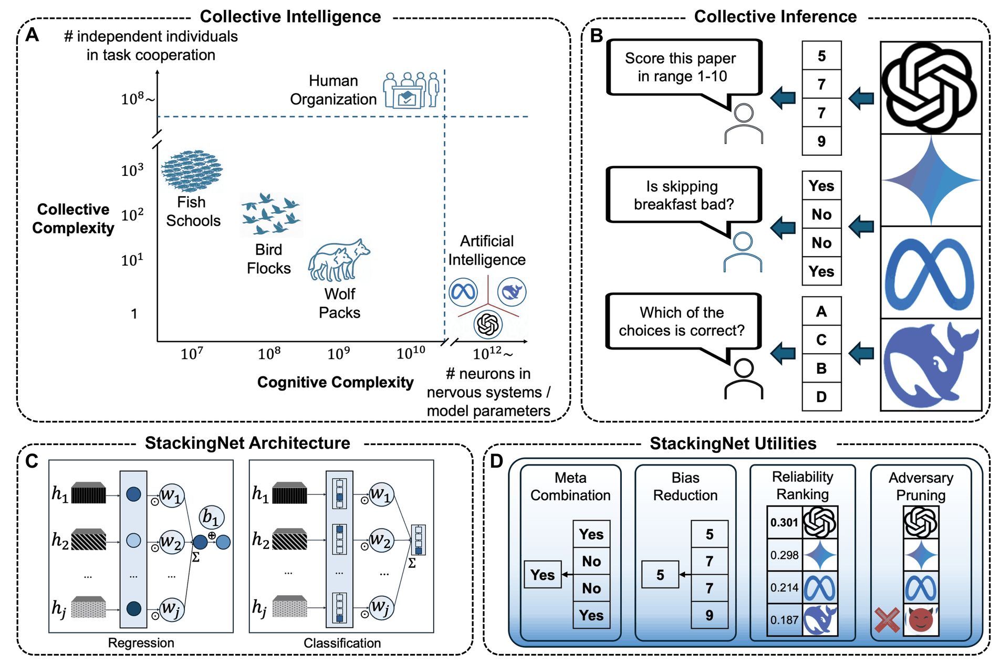
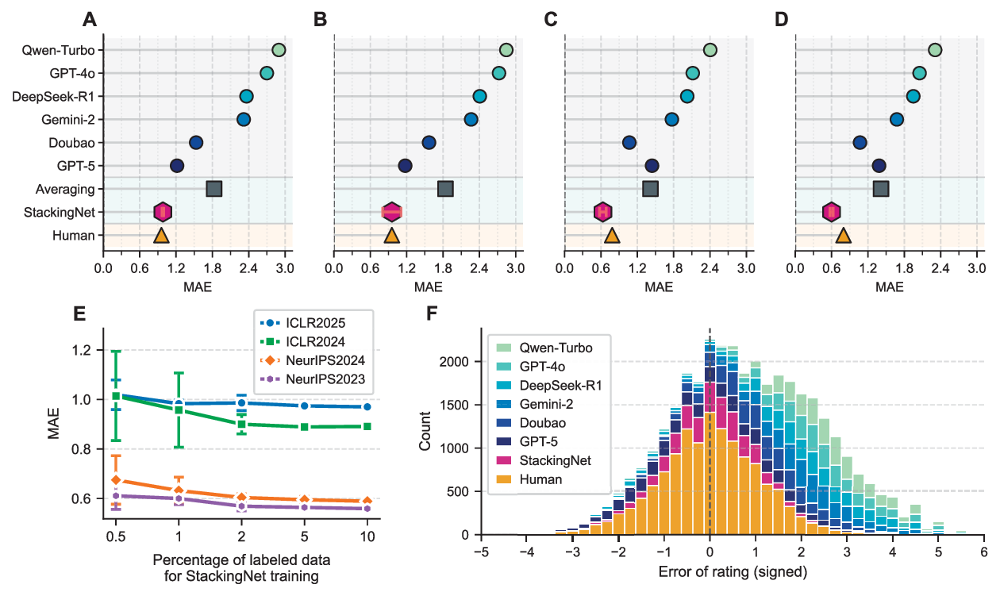
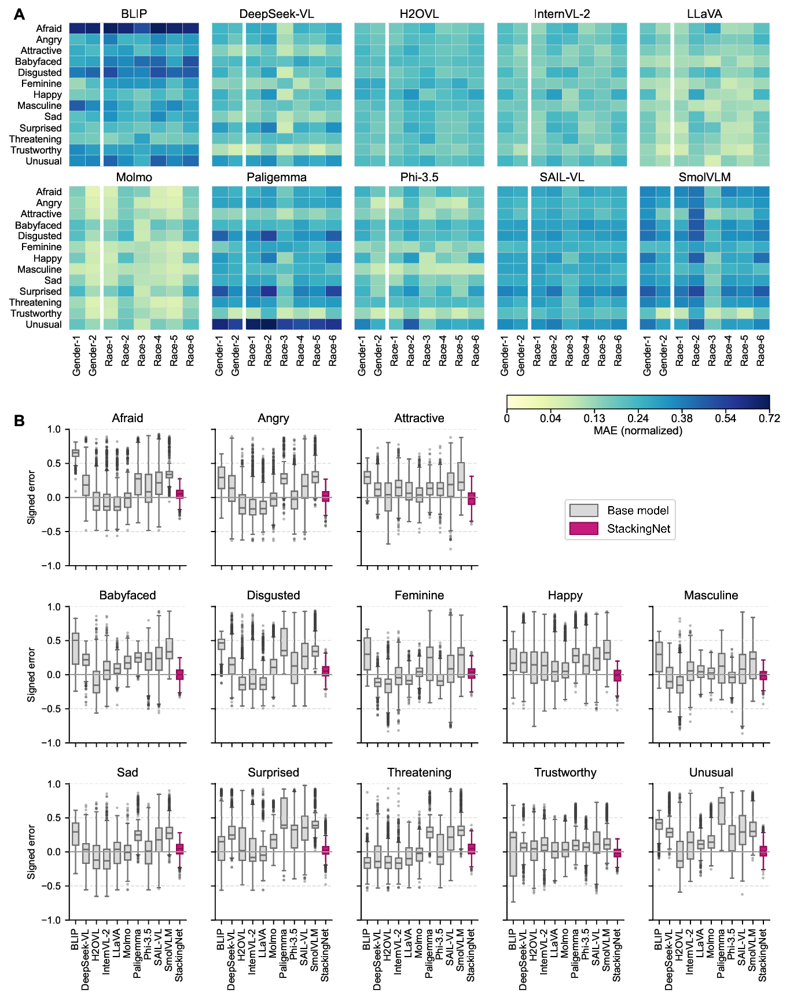
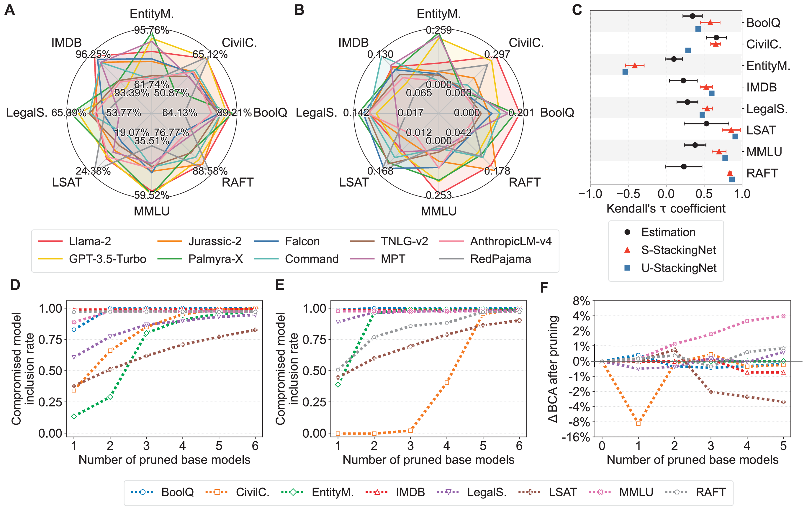

# TestEnsemble: Test-Time Combination of Black-Box Model Predictions

Aggregate the **output predictions** of independent, pre-trained, black-box models at inference —
without any access to their weights, gradients, or training data. This repository is the official
implementation of two papers on post-hoc model combination:

- **SML-OVR** — *Black-Box Test-Time Ensemble*, IEEE Computational Intelligence Magazine, 2026. [[Paper](https://ieeexplore.ieee.org/document/11353100/)]
- **StackingNet** — *Collective Inference across Independent AI Foundation Models*, Advanced Science, 2026. [[BibTeX](#citation)]

<p align="center"></p>

## Overview

Modern foundation models (LLMs and VLMs) are typically served as isolated black boxes: their
internals are hidden, and they cannot share what they have learned. Both methods here treat each
model as a black box and combine only the predictions it emits on the test set, estimating which
models are reliable and weighting them accordingly. This needs no retraining and no model internals —
only the assumption that the base models are reasonably diverse (conditionally independent given the
label). SML-OVR targets multi-class classification with a fast, label-free spectral estimator;
StackingNet is a lightweight trainable meta-learner that unifies regression and classification and
adds reliability ranking and adversary pruning.

## Installation

```sh
git clone https://github.com/sylyoung/TestEnsemble.git
cd TestEnsemble
pip install -r requirements.txt
```

Python 3.8+ with PyTorch. The combination methods run on CPU in seconds; a GPU is only needed to
(re)generate base-model predictions from the LLMs/VLMs.

## Data

The combination methods run on the **base models' predictions** for each test set, which are the
files this repo works from (all rights to the underlying datasets remain with their original
sources; see [`data/README.md`](data/README.md)). For **SML-OVR**, the four text-classification
datasets (`data/MOSI`, `data/TUSAS`, `data/TweetEval`, `data/WOS`) ship together with the predictions
of all ten base LLMs under `results/<dataset>/`, so those experiments run out of the box. For
**StackingNet**, predictions for the paper-rating and Chicago Face Database tasks live under `data/`,
and the HELM classification outputs are read from `logs/helm/`. The large raw HELM benchmark dump
(`data/helm_full/`, hundreds of MB) is kept local and is not required to reproduce the combination
results.

---

## SML-OVR — Black-Box Test-Time Ensemble

Modern models are increasingly served as black boxes behind APIs — to protect training data, to cut
storage and transmission cost, or to keep domain-specific models encapsulated. Combining or even
just evaluating such models on a new task is hard when the test data are **unlabeled** and the
models' internals are hidden. **SML-OVR** targets exactly this setting: from only the predictions
that `M` black-box classifiers emit on an unlabeled test set, it estimates how reliable each model is
and builds a weighted ensemble that favors the more accurate ones — with no labels, no retraining,
and no access to model internals.

### Method

SML-OVR extends the **Spectral Meta-Learner** (SML) from binary to multi-class classification. In the
binary case, SML forms the `M × M` covariance matrix of the classifiers' predictions; under the
assumption that the classifiers are conditionally independent given the true label, its off-diagonal
entries coincide with a **rank-one** matrix whose leading eigenvector `v` has entries proportional to
`2·πⱼ − 1`, where `πⱼ` is model `j`'s balanced classification accuracy (BCA). Reliability is thus
recovered in **near closed form** — one eigen-decomposition, with no Expectation–Maximization
iterations and nothing to tune.

For `K > 2` classes, SML-OVR solves one **one-vs-rest** binary subtask per class, takes the leading
eigenvector `vₖ` of each, normalizes it, and averages across classes into a single reliability score
per model:

```
v̄_j = (1/K) · Σ_k  v_{k,j} / Σ_{j'} v_{k,j'}
```

These scores define a convex combination of the base predictions, and the final label is the
`argmax` of the aggregated score. The same weights apply whether the models emit hard labels or soft
probability vectors.

**Online updates.** When test samples arrive as a stream, the covariance is updated incrementally in
`O(M²K)` per sample — a cost **independent of the test-set size** — so the weights refresh in
milliseconds. Before enough samples have arrived (fewer samples than models), it falls back to simple
averaging.

Because the learned weights *are* a reliability estimate, one model yields three uses: weighted
**ensembling**, unsupervised **ranking** of the base models, and **pruning** of the weakest ones.
Its practical advantages:

1. **Hyperparameter-free** — nothing to tune.
2. **Fast** — reliabilities come from a single eigen-decomposition; the full offline pass runs in
   under a second on most datasets, and online updates take tens of milliseconds per sample.
3. **Online** — weights update on the fly for streaming/real-time use, matching offline accuracy.
4. **Privacy-preserving** — uses only the models' predictions, never their internals.

### Usage

The four text-classification datasets and all ten base-LLM predictions are included, so the
experiments run directly:

```sh
python ensemble.py --dataset_name MOSI    # choices: MOSI, TUSAS, TweetEval, WOS
python generate_classification_LLM.py     # (optional) regenerate LLM predictions with HuggingFace transformers
```

`ensemble.py` reports balanced accuracy and accuracy for SML-OVR (offline and online) alongside the
full battery of [baseline combination methods](#baseline-combination-methods). In the paper, SML-OVR
is evaluated on **13 datasets** spanning LLM text classification, EEG/time-series, and image
classification (DomainBed); it ranks first on average among all test-time combination methods, while
being far cheaper to compute than the iterative EM-based baselines.

### Results

<p align="center"></p>

*Unsupervised ranking and pruning on the four text datasets ((a) MOSI, (b) TUSAS, (c) TweetEval,
(d) WOS). Each heatmap cell is the SML-OVR weight assigned to a base LLM (columns; their true BCA is
on the bottom axis), and each row is a pruning step that removes the lowest-weighted model. The
label-free weights track the models' true accuracy, and combining only the top-ranked models beats
the single best LLM on all four datasets.*

---

## StackingNet — Collective Inference across Independent AI Foundation Models

<p align="center"></p>

**StackingNet** is a lightweight neural meta-learner that builds a combined prediction from the
outputs of `M` independent base models, using a single set of per-model reliability weights. One
framework covers both task types:

- **Regression:** `Ĥ(x) = wᵀh(x) + b` — per-model weights plus a scalar bias that recalibrates the
  aggregate to the label range. Trained by mean-squared error on a small labeled set, with
  non-negativity constraints; only `M+1` parameters.
- **Classification:** `Ĥ(x) = h(x)·w` over one-hot base predictions, with `wⱼ` the reliability of
  model `j`. Trained with cross-entropy when labels exist, and/or an **unsupervised** objective that
  aligns each model to the aggregated consensus, plus a sum-to-one weight regularizer. Weights are
  initialized from uniform voting or balanced-accuracy scores.

Because the learned weight vector *is* a reliability estimate, the same model yields four utilities
(Figure above, panel d):

- **Meta-combination** — a more accurate aggregate than any single model or simple averaging.
- **Error & group-disparity reduction** — averages out model-specific bias; lowers worst-group error
  on facial-attribute rating.
- **Reliability ranking** — orders base models by learned weight, supervised (**S-StackingNet**) or
  fully unsupervised (**U-StackingNet**).
- **Adversary pruning** — flags and removes the lowest-weight (e.g. compromised) models.

It is efficient to train, privacy-preserving, and effective with as little as 1% labeled data (or
none, for the unsupervised variants).

### Usage

```sh
python regression_stackingnet_paperreview.py   # regression: research-paper rating (ICLR/NeurIPS)
python regression_stackingnet_cfd.py           # regression: Chicago Face Database attribute rating
python classification_stackingnet.py           # classification: HELM (+ reliability ranking & adversary pruning)
```

`--golden_num` sets the percentage of labeled data used to train the meta-learner (few-shot by
default).

### Results

<p align="center"></p>

*Research-paper rating (MAE, lower is better): combining LLMs beats every individual LLM, and
few-shot StackingNet matches or exceeds an individual human reviewer across four venues.*

<p align="center"></p>

*Facial-attribute rating on the Chicago Face Database: StackingNet collapses the wide, directionally
skewed per-model error distributions into a compact one centered near zero, reducing worst-group
disparities.*

<p align="center"></p>

*HELM classification: StackingNet's learned weights recover the ground-truth model ranking (a–c),
detect compromised models (d–e), and keep ensemble accuracy stable while pruning weak models (f).*

### Additional analyses

The [`analysis/`](analysis/) directory contains self-contained follow-up experiments — a
group-fairness battery (accuracy parity, demographic parity, bias amplification), inter-model
dependence and controlled degradation under violated independence, dispersion–gain, and human
leave-one-out. Each script runs on CPU from already-generated predictions (no GPU, no re-querying).
See [`analysis/RESULTS_SUMMARY.md`](analysis/RESULTS_SUMMARY.md) and
[`analysis/REPRODUCTION_REPORT.md`](analysis/REPRODUCTION_REPORT.md).

---

## Baseline combination methods

Both papers compare against a common battery of prediction-combination methods from the crowdsourcing
and ensemble literature. Each estimates per-model reliability and aggregates accordingly; all operate
on predictions alone. Implementations live in [`algs/`](algs/), with several drawn from the
[`crowd-kit`](https://github.com/Toloka/crowd-kit) library.

| Method | Description | Reference |
| --- | --- | --- |
| **Voting** | Plurality vote; the class with the most votes wins, ties broken at random. | classical |
| **WAwA** | Worker Agreement with Aggregate: reliability = agreement with the majority-vote consensus, then a weighted vote. | heuristic (crowd-kit) |
| **Dawid–Skene** | EM over a per-model confusion matrix, jointly inferring true labels and error rates. | J. R. Stat. Soc. C, 1979 |
| **GLAD** | Generative model of Labels, Abilities and Difficulties; EM over model ability and item difficulty. | NeurIPS 2009 |
| **MACE** | Multi-Annotator Competence Estimation; EM that models unreliable "spamming" annotators. | NAACL-HLT 2013 |
| **M-MSR** | Matrix-Mean-Subsequence-Reduced; robust reliability via iterative filtering of extreme values. | NeurIPS 2020 |
| **KOS** | Karger–Oh–Shah iterative message passing (binary classification only). | NeurIPS 2011 |
| **ZenCrowd** (`ZC`) | EM inference over a probabilistic factor graph. | WWW 2012 |
| **PM** | Participant-Mine voting; minimizes weighted disagreement between observations and inferred truths. | AAAI / SIGMOD 2014 |
| **LA** | Label Aggregation; a dynamic Bayesian network that estimates qualities and labels in two passes. | ACM TKDD 2024 |
| **LAA** | Label-Aware Autoencoders; an encoder–decoder net that infers labels via a reconstruction loss. | IJCAI 2017 |
| **EBCC** | Enhanced Bayesian Classifier Combination; variational inference with per-model, subtype-varying reliability. | ICML 2019 |
| **SML** | Spectral Meta-Learner; unsupervised reliability from spectral decomposition (**SML-OVR** is the multi-class one-vs-rest extension). | PNAS 2014 |

For regression, StackingNet is compared against uniform **averaging** and a classic linear
**StackingRegressor** (supervised stacked generalization; Wolpert, *Neural Networks*, 1992).

## Repository structure

```
algs/                                  # combination methods (StackingNet + baselines: PM, ZC, LA, LAA, EBCC, ...)
ensemble.py                            # SML-OVR experiment driver (runs the full method battery)
generate_classification_LLM.py         # generate LLM predictions for classification (HuggingFace)
generate_regression_VLM.py             # generate VLM predictions for attribute rating
regression_stackingnet_paperreview.py  # StackingNet — research-paper rating
regression_stackingnet_cfd.py          # StackingNet — Chicago Face Database attribute rating
classification_stackingnet.py          # StackingNet — HELM classification, ranking, pruning
analysis/                              # follow-up analyses (fairness, dependence, dispersion–gain, ...)
data/  logs/  results/                 # base-model predictions, HELM outputs, and saved results
figures/                               # figures used in this README
```

## Citation

If you find this repository helpful, please cite our work:

```bibtex
@Article{Li2026SMLOVR,
  author={Li, Siyang and Wang, Ziwei and Liu, Chenhao and Wu, Dongrui},
  journal={IEEE Computational Intelligence Magazine},
  title={Black-Box Test-Time Ensemble},
  year={2026},
  volume={21},
  number={1},
  pages={57-68}
}

@Article{Li2026StackingNet,
  author={Li, Siyang and Liu, Chenhao and Wu, Dongrui and Zeng, Zhigang and Ding, Lieyun},
  journal={Advanced Science},
  title={StackingNet: Collective Inference across Independent AI Foundation Models},
  year={2026}
}
```

## Contact

For questions about the paper/research, contact syoungli@hust.edu.cn or lsyyoungll@gmail.com. For
questions about the code, please open an Issue.

## License

Released under the [MIT License](LICENSE).
